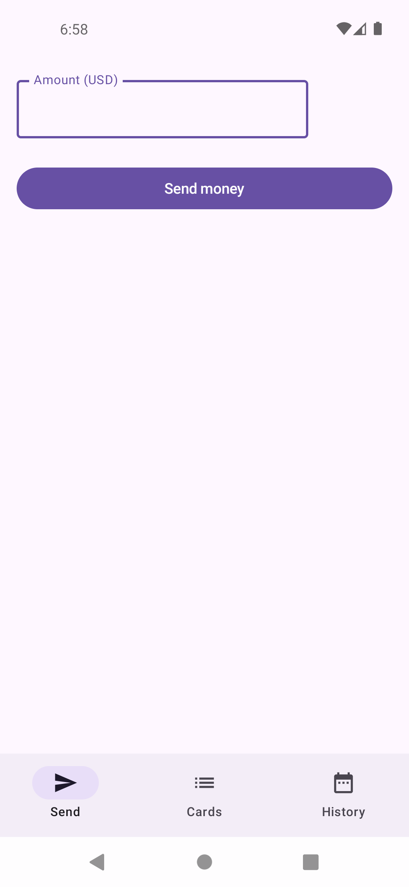
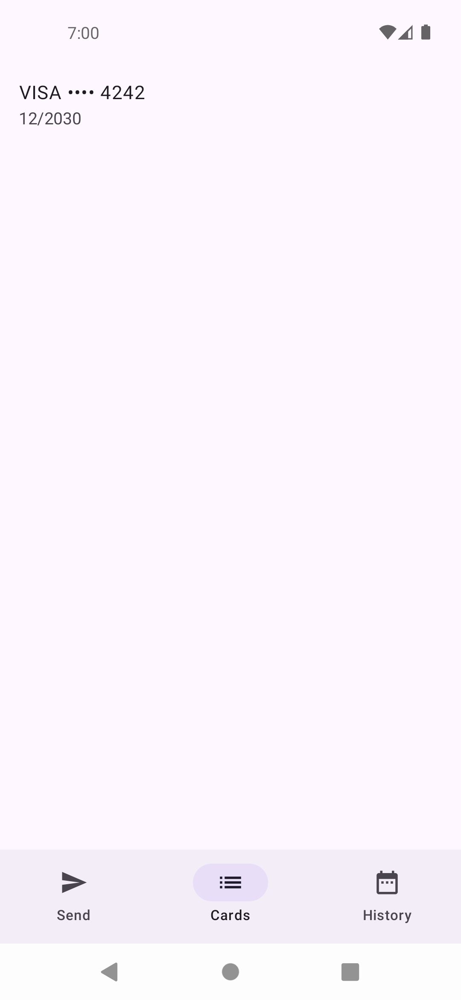
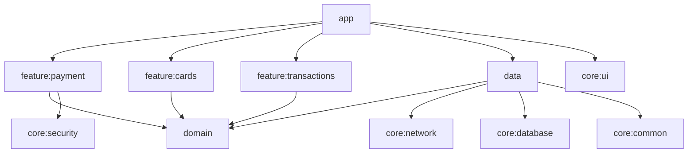
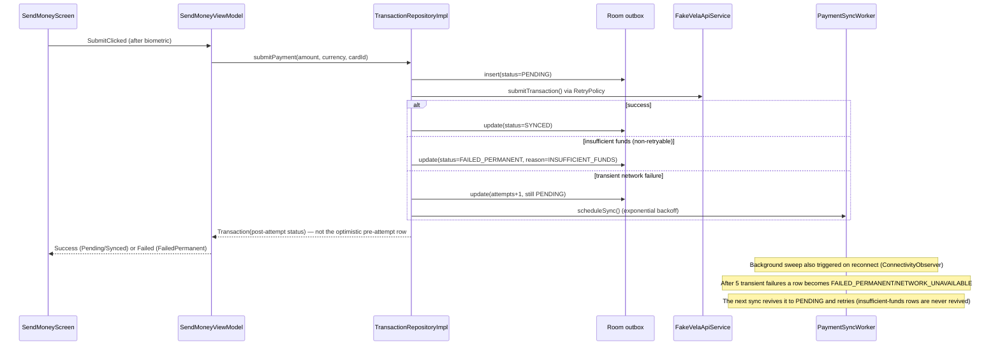

# Fintech Mobile Patterns (Android)

Hey! 👋 This is a sample Android app that shows how a real fintech app handles the tricky stuff: sending money in different currencies, confirming payments with your fingerprint or face, keeping working even when your internet drops, and gracefully recovering when something goes wrong.

It's built with modern Android tools — Clean Architecture, MVI, Jetpack Compose, and Hilt — the same way a production banking or payments app would be. It's a companion to [clean-architecture-android](https://github.com/nerojust/clean-architecture-android), which covers the same architecture on a simpler app.

## Meet "Vela"

Vela is a made-up multi-currency wallet app — think "send money to a friend abroad." It's entirely fictional: no real company's code, branding, or backend is used anywhere. Instead of talking to a real server, it talks to a fake one (`FakeVelaApiService`) that lives right inside the app and can simulate slow connections or random failures — which is exactly what makes it useful for showing off error handling and retries.

Here's what it does, and what each part is meant to demonstrate:

| What you can do | What it's showing off |
|---|---|
| Send money and see it convert between currencies live | Handling multi-currency payments |
| Confirm a payment with your fingerprint/face | Biometric-secured payments |
| Manage cards without ever storing the full card number | Keeping sensitive data safe |
| Watch a payment go from "Pending" to "Sent" (even offline!) | Offline-first design |
| See a clear reason when a payment fails, with a way to retry | Friendly error recovery |
| Have a failed payment quietly retry itself in the background | Automatic retry with backoff |

## What it looks like

There's a simple bottom nav bar with three tabs: Send, Cards, and History.

| Send money | Cards | Transaction history |
|---|---|---|
|  |  |  |

## How it's organized

The app is split into small, focused modules instead of one giant codebase. This keeps things testable and easy to reason about — each box below only knows about the boxes it points to.

## The interesting part: what happens when you tap "Send"

This is the heart of the app, so it's worth walking through. When you send money, the app doesn't just fire off a network request and hope for the best — it saves the payment locally *first*, so it's never lost even if your phone loses signal or the app gets closed. Then it tries to actually send it, and handles whatever happens next:

In plain English:
1. **Save it locally first.** The payment is written to a local database as "Pending" before anything touches the network. If the app closes right now, nothing is lost.
2. **Try to send it.** If it works, it's marked "Synced." If the bank would actually decline it (like insufficient funds), it's marked as permanently failed — retrying wouldn't help.
3. **If it's just a flaky connection**, the app quietly keeps trying in the background, with a little extra wait between each try (this is called "exponential backoff"), and also retries automatically the moment your internet comes back.

## A couple of ways this differs from the companion repo

If you've looked at [clean-architecture-android](https://github.com/nerojust/clean-architecture-android) already, here's what's different here and why:

- The `domain` module still has zero Android-specific code in it, same as before — it's just plain Kotlin, so the core business logic is easy to test.
- The `data` module *does* use Android-specific tools here (Room for the local database, WorkManager for background retries) — that's new compared to the companion repo, because offline support needs them.
- All the dependency-injection wiring (Hilt) lives only in the `app` module, keeping every other module simple and framework-free.

## How this lines up with real security standards

This is a sample app, not a certified system — but the security patterns it demonstrates aren't made up. They map to two standards real fintech and payments teams actually get measured against: [OWASP MASVS](https://mas.owasp.org/MASVS/) (the standard checklist for mobile app security) and [PCI DSS](https://www.pcisecuritystandards.org/) (the standard for handling card data).

**OWASP MASVS controls this app demonstrates:**

| Control | What covers it here |
|---|---|
| MASVS-STORAGE-1 (sensitive data stored securely) | `EncryptedTokenStore` — Keystore-backed via `EncryptedSharedPreferences` |
| MASVS-STORAGE-2 (no sensitive data leaks via logs) | `RedactingTree` strips card numbers, amounts, and tokens before anything reaches logcat |
| MASVS-CRYPTO-1 (strong, current cryptography) | AES-256 (GCM/SIV) via Android Keystore, not a hand-rolled cipher |
| MASVS-AUTH-2 (sensitive actions require re-authentication) | Biometric confirmation gates every payment submission |
| MASVS-NETWORK-2 (TLS pinning for high-risk connections) | Network security config with a certificate-pinning stub, ready for a real backend |

**What this app does *not* attempt** (worth knowing, since MASVS also covers this): MASVS-RESILIENCE controls like root detection, anti-tampering, and anti-debugging are intentionally left out — see "Things that are intentionally left simple" below.

**PCI DSS alignment:** the app never stores, logs, or transmits a full card number — `Card` only ever holds `last4` + brand + expiry (PCI DSS Requirement 3, protecting stored cardholder data). Logs are redacted before anything sensitive could reach them (Requirement 10's ban on logging sensitive authentication data). It's not a PCI DSS *certified* system — there's no real payment processor, no QSA audit — but the data-handling discipline is the same.

## Getting it running

1. Clone the repo and open it in Android Studio (Ladybug or newer).
2. Make sure you have Android SDK platform 35 and build-tools 35.0.0 installed.
3. Connect a device or emulator, then run `./gradlew :app:installDebug` (or just hit ▶️ in Android Studio).
4. To try the send-money flow, your device/emulator needs at least one fingerprint or face enrolled — that's just how Android's biometric prompt works.

## Running the tests

- Everything: `./gradlew test`
- One module at a time: `./gradlew :domain:test`, `./gradlew :data:test`, `./gradlew :feature:payment:testDebugUnitTest`, and so on
- A few tests need a connected device/emulator (they touch real Android APIs like the database and biometrics):
  - `./gradlew :core:database:connectedAndroidTest`
  - `./gradlew :core:security:connectedAndroidTest`
  - `./gradlew :feature:payment:connectedDebugAndroidTest`
- Code style check: `./gradlew ktlintCheck detekt`

## Things that are intentionally left simple

This is a sample app, so a few things were deliberately kept basic rather than fully built out:

- There's no real bank or payment processor behind this — it's all a fake, in-app backend. Swapping in a real one later would just mean writing one new class and pointing the app at it.
- You can't delete a card yet — the fake backend doesn't support it.
- The Cards screen shows your cards, but doesn't have buttons to add or remove one yet, even though all the logic behind the scenes for that already works and is tested.
- There's a secure, encrypted place to store login tokens (`EncryptedTokenStore`) ready to go, but since this demo has no login screen, it's not hooked up to anything yet.
- No fraud detection, remote kill-switch, or crash reporting — those are real production concerns, but out of scope for a sample focused on architecture patterns.

## Let's connect

- [LinkedIn](https://www.linkedin.com/in/nerojust/)
- [Medium](https://medium.com/@nerojust4)
- [Dev.to](https://dev.to/nerojust/building-payment-flows-in-android-lessons-from-real-fintech-apps-5a09) — building payment flows in Android, lessons from real fintech apps
- [GitHub](https://github.com/Nerojust) — follows appreciated

## License

MIT — see [LICENSE](LICENSE).
