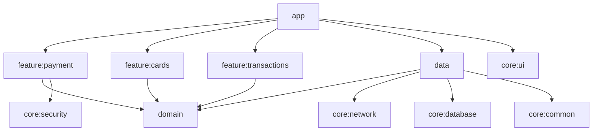
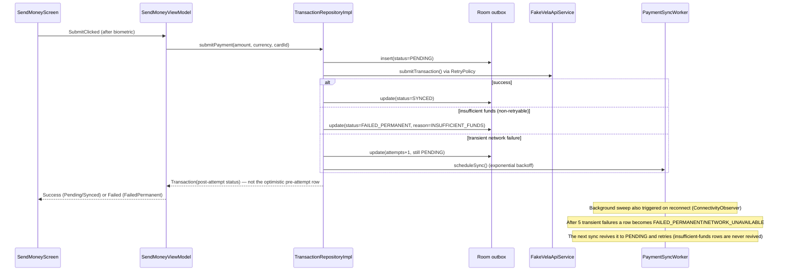

# Fintech Mobile Patterns (Android)

A production-oriented Android sample demonstrating fintech-specific mobile patterns — multi-currency payments, biometric-gated confirmation, offline-first transaction handling, typed error recovery, and retry with exponential backoff — built with Clean Architecture, MVI, Jetpack Compose, and Hilt. Companion to [clean-architecture-android](https://github.com/nerojust/clean-architecture-android), which demonstrates the same architectural shape on a simpler domain.

## Sample app: "Vela"

A fictional multi-currency wallet. No employer code, branding, or real API shape appears anywhere — the backend is a fake, in-process implementation (`FakeVelaApiService`) with injectable simulated latency and failure rate, standing behind the same `VelaApiService` interface a real Retrofit-backed client would implement.

| Feature | Demonstrates |
|---|---|
| Send money (multi-currency, live conversion) | Multi-currency payment UX |
| Biometric confirmation before submit | Biometric-gated payment flow |
| Card management (masked PAN — last4/brand/expiry only) | No-raw-PAN-on-client pattern |
| Transaction history (Pending / Synced / Failed) | Offline-first state visibility |
| Failed payment recovery with typed failure reasons | Error recovery UX |
| Background resubmission with exponential backoff | Retry logic |

## Screenshots

A bottom navigation bar (Send / Cards / History) switches between the three feature screens.

| Send money | Cards (masked PAN) | Transaction history |
|---|---|---|
|  |  |  |

## Module graph

## Offline-first & retry flow

## Why this structure differs from clean-architecture-android

- `:domain` stays pure-Kotlin JVM, zero Android dependencies — same rule as the companion repo.
- `:data` **is** an Android library module here (the companion repo's `:data` is pure JVM). This repo's `:data` wires Room (`:core:database`) for the offline outbox and a `WorkManager` `CoroutineWorker` for background sync — both are Android APIs. The domain/data boundary that matters (business logic has zero Android dependency) is still enforced at `:domain`.
- Hilt `@Module`/`@Binds`/`@Provides` wiring lives only in `:app`, exactly as in the companion repo — every other module uses plain `@Inject`/`@AssistedInject` constructors.
- A payment is written to the Room outbox as `PENDING` *before* any network call — this is what makes it offline-first: the write survives process death, so a payment the user believes was submitted cannot silently vanish if the app is killed.

## Setup

1. Clone the repo and open it in Android Studio (Ladybug or newer).
2. Ensure Android SDK platform 35 and build-tools 35.0.0 are installed.
3. Run `./gradlew :app:installDebug` with a device/emulator connected, or use the `app` run configuration in Android Studio.
4. The device/emulator needs at least one enrolled biometric (fingerprint or face) to complete the send-money flow — Android's biometric APIs require this.

## Testing

- All unit tests: `./gradlew test`
- Per module: `./gradlew :domain:test`, `./gradlew :data:test`, `./gradlew :feature:payment:testDebugUnitTest`, etc.
- Room DAO test (requires a connected device/emulator): `./gradlew :core:database:connectedAndroidTest`
- `EncryptedTokenStore` round-trip test (requires a connected device/emulator): `./gradlew :core:security:connectedAndroidTest`
- Compose UI tests (requires a connected device/emulator): `./gradlew :feature:payment:connectedDebugAndroidTest`
- Lint: `./gradlew ktlintCheck detekt`

## Known simplifications (extension points)

- No real payment processor/backend — `FakeVelaApiService` is in-process only. Swapping in a real Retrofit client means implementing `VelaApiService` against a real host and rebinding it in `di/NetworkModule.kt` — no change needed anywhere else.
- `CardRepository.removeCard` is a no-op — the fake backend has no delete endpoint yet.
- The cards list screen is currently display-only: `CardsViewModel`, `CardsIntent.AddCardClicked`/`RemoveCard`, `AddCardUseCase`, and `RemoveCardUseCase` are fully wired and tested (adding a card genuinely persists through the fake backend), but `CardsContent` doesn't yet expose any UI (a FAB, a swipe action) to trigger either intent.
- `core:security`'s `EncryptedTokenStore` (Keystore-backed via `EncryptedSharedPreferences`) is available for encrypted auth-token storage and verified by an instrumented save/get/clear round-trip test, but it is not yet wired into a login/session screen — this demo app has no auth flow to attach it to.
- No root/jailbreak detection, remote config, or crash reporting — out of proportion for a pattern-demonstration repo.
- No screenshot testing (Paparazzi/Roborazzi) — deferred, not needed to demonstrate the core testing pyramid.

## License

MIT — see [LICENSE](LICENSE).
